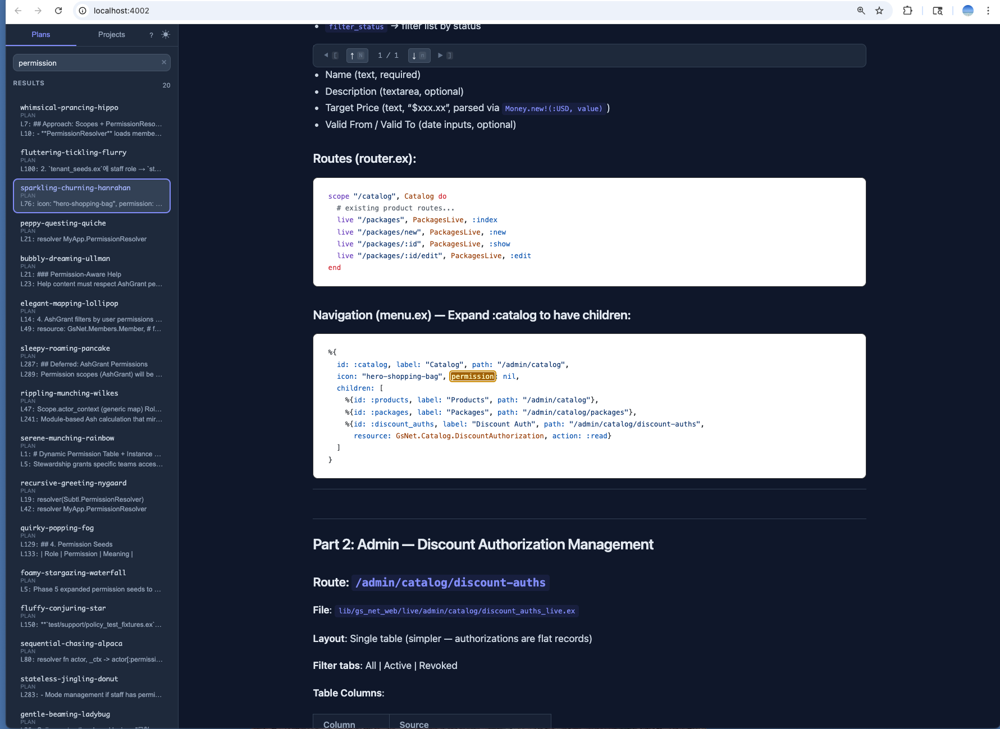

# Claude Plans

Standalone viewer for [Claude Code](https://claude.com/claude-code) plans and project memory files.

Browse `~/.claude/plans/` and `~/.claude/projects/*/memory/` in a clean, searchable web UI with live file watching, syntax highlighting, and Mermaid diagram support.





### Annotation Output (copy to Claude Code terminal)

```
Plan annotations for: refactored-greeting-fog.md

A1 (## Context > paragraph): What is the definition of "active membership"?
A2 (## Context > bullet 3): Can we skip this for MVP?
A3 (## Context): Add edge case for expired but grace-period memberships
A4 (## Data Flow > diagram node A "Member checks in"): Where does this validation happen in the code?
```

## Features

- **Plans tab** — Browse and read Claude Code plan files with live updates
- **Projects tab** — Browse project memory files across all Claude Code projects with diff, history, and annotations
- **Folders tab** — Browse markdown files from any directory on your system with fuzzy directory search, live file watching, and full viewer support
- **Sort & timestamps** — Sort file lists by name (A-Z/Z-A) or modification time (newest/oldest). All file entries show relative modification time (e.g. "1h ago", "2d ago") with live refresh on file changes
- **Version history** — Automatic snapshots on each file change with persistent history
- **Diff view** — Side-by-side line-level diff between any two plan versions with hunk collapsing
- **Activity feed** — Real-time feed of file changes (creates, updates, deletes) across plans and project memory with inline diff preview and direct navigation
- **Dark / Light mode** — Auto-detects OS preference, toggle with one click, persisted in localStorage
- **Server-side Markdown** — Rendered via MDEx with GitHub-style syntax highlighting
- **Mermaid diagrams** — Server-side rendering via MDExMermex (no CDN) with semantic SVG output for node/edge annotation
- **Full-text search** — Search across all plan and project files with instant results and in-document match highlighting
- **Open in editor** — Click "Edit" or press `e` to open the selected file in your editor via `PLUG_EDITOR`
- **Delete files** — Remove plan or project files with `x` or the delete button (with confirmation)
- **Plan annotations** — Inspector mode (`a` key) to select any element — paragraphs, bullets, code block lines, table cells, Mermaid diagram nodes/edges — and attach feedback directions. Copy annotations to clipboard for pasting into Claude Code, or write them directly to the plan file as an end-of-file comment block
- **Keyboard navigation** — Vim-style keys: j/k to navigate, / to search, n/N to jump between matches, d to toggle diff, v to toggle version history, a to annotate, e to edit, x to delete, 1/2/3/4 to switch tabs, ? for help overlay
- **Live file watching** — Plans auto-reload when files change on disk
- **Copy path** — Hover any file to copy its absolute path to clipboard
- **Self-contained** — No Tailwind, no Node.js, no asset pipeline. CSS and JS embedded at compile time
- **Standalone binary** — Single executable via Burrito, no Elixir/Erlang installation required

## Quick Start

### Homebrew (recommended)

```bash
brew tap jhlee111/tap
brew install claude-plans
claude-plans
# Opens http://localhost:4002 in your browser
```

### Direct Download

```bash
# macOS Apple Silicon
curl -L -o claude-plans https://github.com/jhlee111/claude_plans/releases/download/v0.9.0/claude_plans_macos_arm
chmod +x claude-plans
./claude-plans
```

### From Source

```bash
git clone https://github.com/jhlee111/claude_plans.git
cd claude_plans
mix deps.get
mix phx.server
# Visit http://localhost:4002
```

## Command Line Options

All configuration is done via environment variables:

| Variable | Default | Description |
|---|---|---|
| `PORT` | `4002` | HTTP server port |
| `NO_BROWSER` | (unset) | Set to `1` to disable auto-opening browser on launch |
| `PLANS_DIR` | `~/.claude/plans` | Directory containing Claude Code plan files |
| `PROJECTS_DIR` | `~/.claude/projects` | Directory containing Claude Code project directories |
| `PLUG_EDITOR` | (unset) | Editor URL template for "Edit" button (e.g., `vscode://file/__FILE__:__LINE__`) |
| `LOG_LEVEL` | `info` | Log level (`debug`, `info`, `warning`, `error`) |

### Examples

```bash
# Default: starts on port 4002, opens browser
./claude_plans_macos_arm

# Custom port
PORT=3000 ./claude_plans_macos_arm

# Headless (no browser auto-open)
NO_BROWSER=1 ./claude_plans_macos_arm

# Custom plans directory
PLANS_DIR=/path/to/plans ./claude_plans_macos_arm

# Both
PORT=8080 NO_BROWSER=1 ./claude_plans_macos_arm

# Open files in VS Code
PLUG_EDITOR="vscode://file/__FILE__:__LINE__" ./claude_plans_macos_arm

# Open files in Cursor
PLUG_EDITOR="cursor://file/__FILE__:__LINE__" ./claude_plans_macos_arm

# Open files in Zed
PLUG_EDITOR="zed://open/__FILE__:__LINE__" ./claude_plans_macos_arm
```

## Building from Source

### Development

```bash
mix deps.get
mix phx.server
# Visit http://localhost:4002
```

### Standalone Binary

Requires [Zig](https://ziglang.org/) (`brew install zig` on macOS).

```bash
# Build for your native architecture
BURRITO_TARGET=macos_arm MIX_ENV=prod mix release

# Output in burrito_out/
```

> **Note:** Only macOS ARM (Apple Silicon) has been tested. Cross-compilation is not supported
> due to native NIF dependencies (MDEx/Rust) — each target must be built on its matching platform.

Linux and Windows targets are defined but commented out in `mix.exs` (untested). Uncomment and build on the matching platform:

```bash
BURRITO_TARGET=linux_intel MIX_ENV=prod mix release
BURRITO_TARGET=windows_intel MIX_ENV=prod mix release
```

## Architecture

- **Phoenix LiveView** single-page app with two tabs (Plans / Projects)
- **MDEx** for server-side Markdown-to-HTML with syntax highlighting (`github_light` theme)
- **Mermaid CDN** for diagram rendering with light/dark theme support
- **file_system** GenServer with 300ms debounce for live plan file watching
- **Registry** with `:duplicate` keys for PubSub (no dependency on host app)
- **Burrito** for self-extracting standalone binary packaging
- **Compile-time CSS/JS embedding** (Clarity pattern) — fully self-contained, no asset pipeline

## Inspiration

This project was inspired by a comment from **frankdugan3** in the [Ash Framework Discord](https://discord.gg/ash-framework):

> So another fun thing I've done is used MDex to create an alternative to ExDoc that runtime-generates documentation in a LiveView. That way, I can iterate on docs in realtime. It supports most of the ExDoc features, and one of the really nice perks is that I have Claude Code generate the plan docs into the watched extras folders, so I get realtime previews of implementation plans with Mermaid charts, syntax highlighting, etc.
>
> — frankdugan3, Feb 17, 2026

## License

MIT
